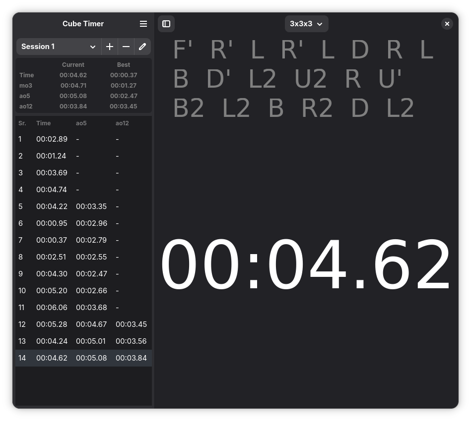

# Cube Timer


Cube Timer is a 3x3 Rubiks Cube Timer application for the GNOME desktop.

## Installing

<a href='https://flathub.org/apps/io.github.vallabhvidy.CubeTimer'>
    
</a>

CubeTimer is available as a flatpak on flathub.

## Screenshots

|           |           |
| :--------------------------------------------------:| :--------------------------------------------------:|
| Stopped Timer                                       | Running Timer                                       |

|              |              |
| :--------------------------------------------------:| :--------------------------------------------------:|
| Delete or Mark DNF                                  | Light Mode                                          |

## How to use

1. Scramble the 3x3 Rubiks Cube with the mentioned scramble.
2. Inspect the cube.
3. Long press and release the space bar to start the timer.
4. Press any key to stop the timer.

## How to build from source

This project is primarily developed in [GNOME Builder](https://developer.gnome.org/documentation/introduction/builder.html). After cloning and opening the project, you can press run to verify you have all correct dependencies installed.
You might need to install meson, if it is not already available on your system.
When the project successfully ran, you can create a Flatpak-bundle on the buildchain menu, which you then can install on your system.

You can also build and install this project by running the following in the root of the project:

```sh
flatpak-builder builddir --user --install --force-clean io.github.vallabhvidy.CubeTimer.json
```

## Feedback and bug reports

If you found an issue or have general feedback, please file an issue.


